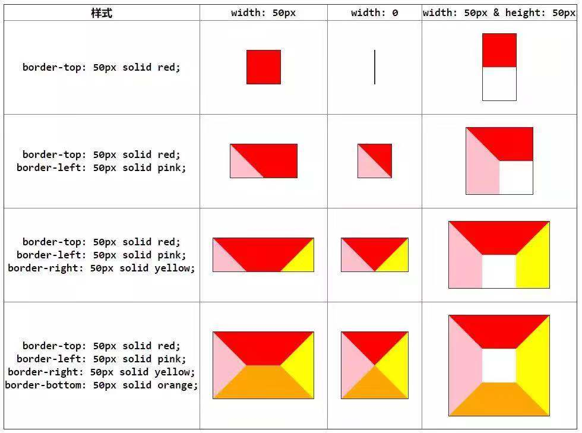
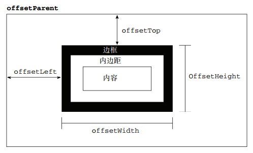
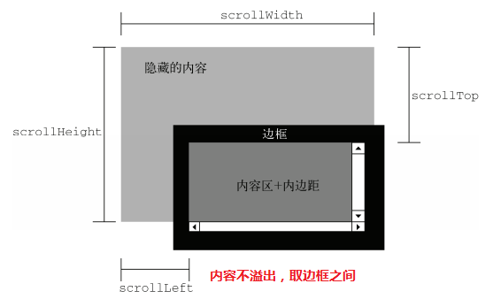
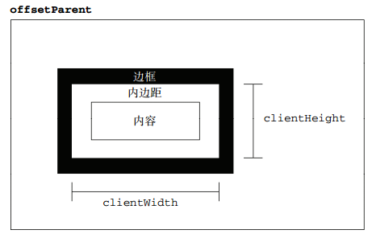

# [返回主页](https://github.com/yisainan/web-interview/blob/master/README.md)

<b><details><summary>1.实现不使用 border 画出 1px 高的线，在不同浏览器的标准模式与怪异模式下都能保持一致的效果。</summary></b>

答案：

```html
<div style="height:1px;overflow:hidden;background:red"></div>
```

</details>

<b><details><summary>2.介绍一下标准的 CSS 的盒子模型？低版本 IE 的盒子模型有什么不同的？</summary></b>

答案：

（1）有两种， IE 盒子模型、W3C 盒子模型；

（2）盒模型： 内容(content)、填充(padding)、边界(margin)、 边框(border)；

（3）区 别： IE 的 content 部分把 border 和 padding 计算了进去;

</details>

<b><details><summary>3.CSS 隐藏元素的几种方法（至少说出三种）</summary></b>

答案：

Opacity:元素本身依然占据它自己的位置并对网页的布局起作用。它也将响应用户交互;

Visibility:与 opacity 唯一不同的是它不会响应任何用户交互。此外，元素在读屏软件中也会被隐藏;

Display:display 设为 none 任何对该元素直接打用户交互操作都不可能生效。此外，读屏软件也不会读到元素的内容。这种方式产生的效果就像元素完全不存在;

Position:不会影响布局，能让元素保持可以操作;

Clip-path:clip-path 属性还没有在 IE 或者 Edge 下被完全支持。如果要在你的 clip-path 中使用外部的 SVG 文件，浏览器支持度还要低;

</details>

<b><details><summary>4.CSS 清除浮动的几种方法（至少两种）</summary></b>

答案：

```
清除浮动： 核心：clear:both;

1.使用额外标签法（不推荐使用）

在浮动的盒子下面再放一个标签，使用 clear:both;来清除浮动

a 内部标签：会将父盒子的高度重新撑开

b 外部标签：只能将浮动盒子的影响清除，但是不会撑开盒子

2.使用 overflow 清除浮动（不推荐使用）

先找到浮动盒子的父元素，给父元素添加一个属性：overflow:hidden;就会清除子元素对页面的影响

3.使用伪元素清除浮动(用的最多)

伪元素：在页面上不存在的元素，但是可以通过 css 添加上去

种类：
                  :after(在。。。之后)
                  :before(在。。。之前)

注意：每个元素都有自己的伪元素

.clearfix:after {
    content:"";
    height:0;
    line-height:0;
    display:block;
    clear:both;
    visibility:hidden;  /_将元素隐藏起来_/ 
      在页面的 clearfix 元素后面添加了一个空的块级元素
     （这个元素的高为 0 行高也为 0   并且这个元素清除了浮动）
}
.clearfix {
  zoom:1;/_为了兼容 IE6_/
}
```

</details>

<b><details><summary>5.页面导入样式时，使用 link 和@import 有什么区别？</summary></b>

答案：

1. Link 属于 html 标签，而@import 是 CSS 中提供的

2. 在页面加载的时候，link 会同时被加载，而@import 引用的 CSS 会在页面加载完成后才会加载引用的 CSS

3. @import 只有在 ie5 以上才可以被识别，而 link 是 html 标签，不存在浏览器兼容性问题

4. Link 引入样式的权重大于@import 的引用（@import 是将引用的样式导入到当前的页面中）

</details>

<b><details><summary>6.伪元素和伪类的区别？</summary></b>

答案：

1、伪元素使用 2 个冒号，常见的有：::before，::after，::first-line，::first-letter，::selection、::placeholder 等；

      伪类使用1个冒号，常见的有：:hover，:link，:active，:target，:not()，:focus等。

2、伪元素添加了一个页面中没有的元素（只是从视觉效果上添加了，不是在文档树中添加）；

      伪类是给页面中已经存在的元素添加一个类。

</details>

<b><details><summary>7. CSS 选择符有哪些？哪些属性可以继承？优先级算法如何计算？ CSS3 新增伪类有那些？</summary></b>

答案：

```
        1.id选择器（ # myid）

        2.类选择器（.myclassname）

        3.标签选择器（div, h1, p）

        4.相邻选择器（h1 + p）

        5.子选择器（ul < li）

        6.后代选择器（li a）

        7.通配符选择器（ * ）

        8.属性选择器（a[rel = "external"]）

        9.伪类选择器（a: hover, li: nth - child）

    *   可继承： font-size font-family color, UL LI DL DD DT;

    *   不可继承 ：border padding margin width height ;

    *   优先级就近原则，样式定义最近者为准;

    *   载入样式以最后载入的定位为准;

优先级为:

       !important >  id > class > tag  

       important 比 内联优先级高

CSS3新增伪类举例：

    p:first-of-type 选择属于其父元素的首个 <p> 元素的每个 <p> 元素。

    p:last-of-type  选择属于其父元素的最后 <p> 元素的每个 <p> 元素。

    p:only-of-type  选择属于其父元素唯一的 <p> 元素的每个 <p> 元素。

    p:only-child    选择属于其父元素的唯一子元素的每个 <p> 元素。

    p:nth-child(2)  选择属于其父元素的第二个子元素的每个 <p> 元素。

    :enabled、:disabled 控制表单控件的禁用状态。

    :checked，单选框或复选框被选中。

```

</details>

<b><details><summary>8. 行内元素和块级元素的具体区别是什么？行内元素的 padding 和 margin 可设置吗？</summary></b>

答案：

- 块级元素(block)特性：

  - 总是独占一行，表现为另起一行开始，而且其后的元素也必须另起一行显示;
  - 宽度(width)、高度(height)、内边距(padding)和外边距(margin)都可控制;

- 内联元素(inline)特性：
  - 和相邻的内联元素在同一行;
  - 宽度(width)、高度(height)、内边距的 top/bottom(padding-top/padding-bottom)和外边距的 top/bottom(margin-top/margin-bottom)都不可改变（也就是 padding 和 margin 的 left 和 right 是可以设置的），就是里面文字或图片的大小。

那么问题来了，浏览器还有默认的天生 inline-block 元素（拥有内在尺寸，可设置高宽，但不会自动换行），有哪些？

答案：`<input> 、 、<button> 、<texterea> 、<label>。`

</details>

<b><details><summary>9. 什么是外边距重叠？重叠的结果是什么？</summary></b>

答案：

外边距重叠就是 margin-collapse。

在 CSS 当中，相邻的两个盒子（可能是兄弟关系也可能是祖先关系）的外边距可以结合成一个单独的外边距。这种合并外边距的方式被称为折叠，并且因而所结合成的外边距称为折叠外边距。

折叠结果遵循下列计算规则：

1. 两个相邻的外边距都是正数时，折叠结果是它们两者之间较大的值。

2. 两个相邻的外边距都是负数时，折叠结果是两者绝对值的较大值。

3. 两个外边距一正一负时，折叠结果是两者的相加的和。

</details>

<b><details><summary>10. rgba()和 opacity 的透明效果有什么不同？</summary></b>

答案：

rgba()和 opacity 都能实现透明效果，但最大的不同是 opacity 作用于元素，以及元素内的所有内容的透明度，

而 rgba()只作用于元素的颜色或其背景色。（设置 rgba 透明的元素的子元素不会继承透明效果！）

</details>

<b><details><summary>11. css 中可以让文字在垂直和水平方向上重叠的两个属性是什么？</summary></b>

答案：

垂直方向：line-height

水平方向：letter-spacing

那么问题来了，关于 letter-spacing 的妙用知道有哪些么？

答案:可以用于消除 inline-block 元素间的换行符空格间隙问题。

</details>

<b><details><summary>12. px 和 em 的区别。</summary></b>

答案：px 和 em 都是长度单位，区别是，px 的值是固定的，指定是多少就是多少，计算比较容易。em 得值不是固定的，并且 em 会继承父级元素的字体大小。

浏览器的默认字体高都是 16px。所以未经调整的浏览器都符合: 1em=16px。那么 12px=0.75em, 10px=0.625em。

</details>

<b><details><summary>13. 如何垂直居中一个浮动元素？</summary></b>

答案：

```css

// 方法一：已知元素的高宽

#div1{

    background-color:#6699FF;

    width:200px;

    height:200px;

    position: absolute;        //父元素需要相对定位

    top: 50%;

    left: 50%;

    margin-top:-100px ;   //二分之一的height，width

    margin-left: -100px;

    }

 

//方法二:未知元素的高宽

 

  #div1{

    width: 200px;

    height: 200px;

    background-color: #6699FF;

    margin:auto;

    position: absolute;        //父元素需要相对定位

    left: 0;

    top: 0;

    right: 0;

    bottom: 0;

    }

```

那么问题来了，如何垂直居中一个`?`（用更简便的方法。）

```css
#container     //的容器设置如下

 {
  display: table-cell;

  text-align: center;

  vertical-align: middle;
}
```

</details>

<b><details><summary>14.BFC </summary></b>

答案：

- 什么是 BFC

  BFC（Block Formatting Context）格式化上下文，是 Web 页面中盒模型布局的 CSS 渲染模式，指一个独立的渲染区域或者说是一个隔离的独立容器。

- 形成 BFC 的条件

  - 浮动元素，float 除 none 以外的值
  - 定位元素，position（absolute，fixed）
  - display 为以下其中之一的值 inline-block，table-cell，table-caption
  - overflow 除了 visible 以外的值（hidden，auto，scroll）

- BFC 的特性
  - 内部的 Box 会在垂直方向上一个接一个的放置。
  - 垂直方向上的距离由 margin 决定
  - bfc 的区域不会与 float 的元素区域重叠。
  - 计算 bfc 的高度时，浮动元素也参与计算
  - bfc 就是页面上的一个独立容器，容器里面的子元素不会影响外面元素。
    </details>

<b><details><summary>15.用纯 CSS 创建一个三角形的原理是什么？ </summary></b>

答案：

```css
span {
  width: 0;
  height: 0;
  border-top: 40px solid transparent;
  border-left: 40px solid transparent;
  border-right: 40px solid transparent;
  border-bottom: 40px solid #ff0000;
}
```



</details>

<b><details><summary>16. Sass、LESS 是什么？大家为什么要使用他们？</summary></b>

答案：他们是 CSS 预处理器。他是 CSS 上的一种抽象层。他们是一种特殊的语法/语言编译成 CSS。

例如 Less 是一种动态样式语言. 将 CSS 赋予了动态语言的特性，如变量，继承，运算， 函数. LESS 既可以在客户端上运行 (支持 IE 6+, Webkit, Firefox)，也可一在服务端运行 (借助 Node.js)。

为什么要使用它们？

结构清晰，便于扩展。

可以方便地屏蔽浏览器私有语法差异。这个不用多说，封装对浏览器语法差异的重复处理，减少无意义的机械劳动。

可以轻松实现多重继承。

完全兼容 CSS 代码，可以方便地应用到老项目中。LESS 只是在 CSS 语法上做了扩展，所以老的 CSS 代码也可以与 LESS 代码一同编译。

</details>

<b><details><summary>17. display:none 与 visibility:hidden 的区别是什么？</summary></b>

答案：

display :  隐藏对应的元素但不挤占该元素原来的空间。

visibility:  隐藏对应的元素并且挤占该元素原来的空间。

即是，使用 CSS display:none 属性后，HTML 元素（对象）的宽度、高度等各种属性值都将“丢失”;而使用 visibility:hidden 属性后，HTML 元素（对象）仅仅是在视觉上看不见（完全透明），而它所占据的空间位置仍然存在。

</details>

<b><details><summary>18. 移动端 1px 问题的解决办法</summary></b>

答案：推荐解决方法：媒体查询 + transfrom

```
/* 2倍屏 */
@media only screen and (-webkit-min-device-pixel-ratio: 2.0) {
    .border-bottom::after {
        -webkit-transform: scaleY(0.5);
        transform: scaleY(0.5);
    }
}
/* 3倍屏 */
@media only screen and (-webkit-min-device-pixel-ratio: 3.0) {
    .border-bottom::after {
        -webkit-transform: scaleY(0.33);
        transform: scaleY(0.33);
    }
}
```

[其他解决方案参考](https://www.jianshu.com/p/31f8907637a6)

</details>

<b><details><summary>19. 哪些 css 属性可以继承？</summary></b>

答案：

可继承： font-size font-family color, ul li dl dd dt;

不可继承 ：border padding margin width height ;

</details>

<b><details><summary>22. 设备像素比</summary></b>

答案：我的书签

</details>

<b><details><summary>24. ::bofore 和 :after 中双冒号和单冒号有什么区别？</summary></b>

答案：

</details>

<b><details><summary>25. 说下 CSS3 中一些样式的兼容，分别指兼容哪些浏览器</summary></b>

答案：

</details>

<b><details><summary>26. 有哪些手段可以优化 CSS, 提高性能</summary></b>

答案：

</details>

<b><details><summary>27. 怎么样实现边框 0.5 个像素？</summary></b>

答案：

</details>

<b><details><summary>28. transform translate transition 的区别</summary></b>

答案：

</details>

<b><details><summary>29. 请解释一下 CSS3 的 Flexbox（弹性盒布局模型）,以及适用场景？</summary></b>

答案：

</details>

<b><details><summary>30. 用纯 CSS 创建一个三角形的原理是什么？</summary></b>

答案：

</details>

<b><details><summary>31. 一个满屏 品 字布局 如何设计?</summary></b>

答案：

</details>

<b><details><summary>32. li 与 li 之间有看不见的空白间隔是什么原因引起的？有什么解决办法？</summary></b>

答案：浏览器的默认行为是把 inline 元素间的空白字符（空格换行 tab）渲染成一个空格，也就是我们上面的代码<li>换行后会产生换行字符，而它会变成一个空格，当然空格就占用一个字符的宽度。

解决方案：

方法一：既然是因为`<li>`换行导致的，那就可以将`<li>`代码全部写在一排，如下

```html
<div class="wrap">
  <h3>li标签空白测试</h3>
  <ul>
    <li class="part1"></li>
    <li class="part2"></li>
    <li class="part3"></li>
    <li class="part4"></li>
  </ul>
</div>
```

方法二：我们为了代码美观以及方便修改，很多时候我们不可能将`<li>`全部写在一排，那怎么办？既然是空格占一个字符的宽度，那我们索性就将`<ul>`内的字符尺寸直接设为 0，将下面样式放入样式表，问题解决。

```css
.wrap ul {
  font-size: 0px;
}
```

但随着而来的就是`<ul>`中的其他文字就不见了，因为其尺寸被设为 0px 了，我们只好将他们重新设定字符尺寸。
方法三：本来以为方法二能够完全解决问题，但经测试，将 li 父级标签字符设置为 0 在 Safari 浏览器依然出现间隔空白；既然设置字符大小为 0 不行，那咱就将间隔消除了，将下面代码替换方法二的代码，目前测试完美解决。同样随来而来的问题是 li 内的字符间隔也被设置了，我们需要将 li 内的字符间隔设为默认。

```css
.wrap ul {
  letter-spacing: -5px;
}
```

之后记得设置 li 内字符间隔

```css
.wrap ul li {
  letter-spacing: normal;
}
```

</details>

<b><details><summary>33. 全屏滚动的原理是什么？用到了 CSS 的那些属性？</summary></b>

答案：

</details>

<b><details><summary>34. 什么是响应式设计？响应式设计的基本原理是什么？如何兼容低版本的 IE？</summary></b>

答案：

</details>

<b><details><summary>35. 何修改 chrome 记住密码后自动填充表单的黄色背景 ？</summary></b>

答案：

</details>

<b><details><summary>36. 你对 line-height 是如何理解的？</summary></b>

答案：

</details>

<b><details><summary>37 .设置元素浮动后，该元素的 display 值是多少？</summary></b>

答案：

自动变成 display:block

</details>

<b><details><summary>38. 怎么让 Chrome 支持小于 12px 的文字？</summary></b>

答案：

</details>

<b><details><summary>39. 让页面里的字体变清晰，变细用 CSS 怎么做？</summary></b>

答案：

-webkit-font-smoothing: antialiased;

</details>

<b><details><summary>40. font-style 属性可以让它赋值为“oblique” oblique 是什么意思？</summary></b>

答案：

</details>

<b><details><summary>41 .position:fixed;在 android 下无效怎么处理？</summary></b>

答案：

</details>

<b><details><summary>42. 如果需要手动写动画，你认为最小时间间隔是多久，为什么？</summary></b>

答案：

</details>

<b><details><summary>43. display:inline-block 什么时候会显示间隙？</summary></b>

答案：间隙产生的原因是因为，换行或空格会占据一定的位置

推荐解决方法：

父元素中设置
font-size:0;letter-spaceing:-4px;

</details>

<b><details><summary>44. overflow: scroll 时不能平滑滚动的问题怎么处理？</summary></b>

答案：

</details>

<b><details><summary>45. 有一个高度自适应的 div，里面有两个 div，一个高度 100px，希望另一个填满剩下的高度。</summary></b>

答案：

</details>

<b><details><summary>46. png、jpg、gif 这些图片格式解释一下，分别什么时候用？，webp 呢</summary></b>

答案：

gif 图形交换格式，索引颜色格式，颜色少的情况下，产生的文件极小，支持背景透明，动画，图形渐进，无损压缩（适合线条，图标等），缺点只有 256 种颜色

jpg 支持上百万种颜色，有损压缩，压缩比可达 180：1，而且质量受损不明显，不支持图形渐进与背景透明，不支持动画

png 为替代 gif 产生的，位图文件，支持透明，半透明，不透明。不支持动画，无损图像格式。Png8 简单说是静态 gif，也只有 256 色，png24 不透明，但不止 256 色。

webp 谷歌开发的旨在加快图片加载速度的图片格式，图片压缩体积是 jpeg 的 2/3，有损压缩。高版本的 W3C 浏览器才支持，google39+，safari7+

</details>

<b><details><summary>47. style 标签写在 body 后与 body 前有什么区别？</summary></b>

答案：

从上向下加载，加载顺序不同

</details>

<b><details><summary>48. CSS 中可以通过哪些属性定义，使得一个 DOM 元素不显示在浏览器可视范围内？</summary></b>

答案：

最基本的：

设置 display 属性为 none，或者设置 visibility 属性为 hidden

技巧性：

设置宽高为 0，设置透明度为 0，设置 z-index 位置在-1000em

</details>

<b><details><summary>49. 超链接访问过后 hover 样式就不出现的问题是什么？如何解决？</summary></b>

答案：被点击访问过的超链接样式不在具有 hover 和 active 了,解决方法是改变 CSS 属性的排列顺序: L-V-H-A（link,visited,hover,active）

</details>

<b><details><summary>50. 什么是 Css Hack？ie6,7,8 的 hack 分别是什么？</summary></b>

答案：针对不同的浏览器写不同的 CSS code 的过程，就是 CSS hack。

示例如下：

```css

#test{
    width:300px;
    height:300px;
    background-color:blue;      /_firefox_/
    background-color:red\9;      /_all ie_/
    background-color:yellow;    /_ie8_/
    +background-color:pink;        /_ie7_/
    \_background-color:orange;       /_ie6_/   
}

 :root #test { background-color:purple\9; }  /*ie9*/

@media all and (min-width:0px)

     { #test {background-color:black;} }  /*opera*/

@media screen and (-webkit-min-device-pixel-ratio:0)

{ #test {background-color:gray;} }       /*chrome and safari*/


```

</details>

<b><details><summary>51. 描述一个”reset”的 CSS 文件并如何使用它。知道 normalize.css 吗？你了解他们的不同之处？</summary></b>

答案：

重置样式非常多，凡是一个前端开发人员肯定有一个常用的重置 CSS 文件并知道如何使用它们。他们是盲目的在做还是知道为什么这么做呢？原因是不同的浏览器对一些元素有不同的默认样式，如果你不处理，在不同的浏览器下会存在必要的风险，或者更有戏剧性的性发生。

你可能会用 Normalize 来代替你的重置样式文件。它没有重置所有的样式风格，但仅提供了一套合理的默认样式值。既能让众多浏览器达到一致和合理，但又不扰乱其他的东西（如粗体的标题）。

在这一方面，无法做每一个复位重置。它也确实有些超过一个重置，它处理了你永远都不用考虑的怪癖，像 HTML 的 audio 元素不一致或 line-height 不一致。

</details>

<b><details><summary>52.css sprite 是什么,有什么优缺点</summary></b>

答案：概念：将多个小图片拼接到一个图片中。通过 background-position 和元素尺寸调节需要显示的背景图案。

优点：

- 减少 HTTP 请求数，极大地提高页面加载速度。
- 增加图片信息重复度，提高压缩比，减少图片大小。
- 更换风格方便，只需在一张或几张图片上修改颜色或样式即可实现。

缺点：

- 图片合并麻烦。
- 维护麻烦，修改一个图片可能需要从新布局整个图片，样式。

</details>

<b><details><summary>53.什么是 FOUC?如何避免</summary></b>

答案：

1. 什么是 Fouc(文档样式短暂失效)？

在引用 css 的过程中，如果方法不当或者位置引用不对，会导致某些页面在 windows 下的 ie 出现一些奇怪的现象，以无样式显示页面内容的瞬间闪烁，这种现象称之为文档样式短暂失效，简称 FOCU。

2. 原因大致为：

- 使用 import 方法导入样式表
- 将样式表放在页面底部
- 有几个样式表，放在 html 结构的不同位置。

3. 其实原理很清楚：当样式表晚于结构性 html 加载，当加载到此样式表时，页面将停止之前的渲染。此样式表被下载和解析后，将重新渲染页面，也就出现了短暂的花屏现象。

4. 解决方法：使用 link 标签将样式表放在文档 head 中。

</details>

<b><details><summary>54.css3 有哪些新特性</summary></b>

答案：

1. 选择器

- E:last-child 匹配父元素的最后一个子元素 E。
- E:nth-child(n)匹配父元素的第 n 个子元素 E。
- E:nth-last-child(n) CSS3 匹配父元素的倒数第 n 个子元素 E。

2. RGBA

回答此问题，面试官很可能继续问：rgba()和 opacity 的透明效果有什么不同？

3. 多栏布局

```html
<div class="mul-col">
  <div>
    <h3>新手上路</h3>
    <p>新手专区 消费警示 交易安全 24小时在线帮助 免费开店</p>
  </div>
  <div>
    <h3>付款方式</h3>
    <p>快捷支付 信用卡 余额宝 蚂蚁花呗 货到付款</p>
  </div>
  <div>
    <h3>淘宝特色</h3>
    <p>手机淘宝 旺信 大众评审 B格指南</p>
  </div>
</div>
```

```css
.mul-col {
  column-count: 3;
  column-gap: 5px;
  column-rule: 1px solid gray;
  border-radius: 5px;
  border: 1px solid gray;
  padding: 10px;
}
```

4. 多背景图

```css
/* backgroundimage:url('1.jpg),url('2.jpg') */
```

5. CSS3 word-wrap 属性

```css
p.test {
  word-wrap: break-word;
}
```

6. 文字阴影

```css
text-shadow: 5px 2px 6px rgba(64, 64, 64, 0.5);
```

7. @font-face 属性

Font-face 可以用来加载字体样式，而且它还能够加载服务器端的字体文件，让客户端显示客户端所没有安装的字体。

```css
@font-face {
  font-family: BorderWeb;
  src: url(BORDERW0.eot);
}
@font-face {
  font-family: Runic;
  src: url(RUNICMT0.eot);
}
.border {
  font-size: 35px;
  color: black;
  font-family: "BorderWeb";
}
.event {
  font-size: 110px;
  color: black;
  font-family: "Runic";
}

/* 淘宝网字体使用 */

@font-face {
  font-family: iconfont;
  src: url(//at.alicdn.com/t/font_1465189805_4518812.eot);
}
```

8. 圆角

```css
border-radius: 15px;
```

9. 边框图片

CSS3 border-image 属性

10. 盒阴影

```css
/* box-shadow: 水平方向的偏移量 垂直方向的偏移量 模糊程度 扩展程度 颜色 是否具有内阴影 */
```

11. 盒子大小

CSS3 box-sizing 属性

12. 媒体查询

CSS3 @media 查询

13. CSS3 动画

@keyframes

```css
@keyframes abc {
  from {
    transform: rotate(0);
  }
  50% {
    transform: rotate(90deg);
  }
  to {
    transform: rotate(360deg);
  }
}
```

animation 属性

```css
/* animation ： name duration timing-function delay interation-count direction play-state */
```

14. 渐变效果

```css
background-image: -webkit-gradient(
  linear,
  0% 0%,
  100% 0%,
  from(#2a8bbe),
  to(#fe280e)
);
```

15. CSS3 弹性盒子模型

- 弹性盒子是 CSS3 的一种新的布局模式。
- CSS3 弹性盒（ Flexible Box 或 flexbox），是一种当页面需要适应不同的屏幕大小以及设备类型时确保元素拥有恰当的行为的布局方式。
- 引入弹性盒布局模型的目的是提供一种更加有效的方式来对一个容器中的子元素进行排列、对齐和分配空白空间。

16. CSS3 过渡

```css
div {
  transition: width 2s;
  -moz-transition: width 2s; /* Firefox 4 */
  -webkit-transition: width 2s; /* Safari 和 Chrome */
  -o-transition: width 2s; /* Opera */
}
```

17. CSS3 变换

- rotate()旋转
- translate()平移
- scale( )缩放
- skew()扭曲/倾斜
- 变换基点
- 3d 转换

[参考](https://www.w3school.com.cn/css3/index.asp)

</details>

<b><details><summary>55.display 有哪些值？说明他们的作用</summary></b>

答案：

display： none | inline | block | list-item | inline-block | table | inline-table | table-caption | table-cell | table-row | table-row-group | table-column | table-column-group | table-footer-group | table-header-group | run-in | box | inline-box | flexbox | inline-flexbox | flex | inline-flex

解析：

默认值：inline

```
none： 隐藏对象。与visibility属性的hidden值不同，其不为被隐藏的对象保留其物理空间
inline： 指定对象为内联元素。
block： 指定对象为块元素。
list-item： 指定对象为列表项目。
inline-block： 指定对象为内联块元素。（CSS2）
table： 指定对象作为块元素级的表格。类同于html标签<table>（CSS2）
inline-table： 指定对象作为内联元素级的表格。类同于html标签<table>（CSS2）
table-caption： 指定对象作为表格标题。类同于html标签<caption>（CSS2）
table-cell： 指定对象作为表格单元格。类同于html标签<td>（CSS2）
table-row： 指定对象作为表格行。类同于html标签<tr>（CSS2）
table-row-group： 指定对象作为表格行组。类同于html标签<tbody>（CSS2）
table-column： 指定对象作为表格列。类同于html标签<col>（CSS2）
table-column-group： 指定对象作为表格列组显示。类同于html标签<colgroup>（CSS2）
table-header-group： 指定对象作为表格标题组。类同于html标签<thead>（CSS2）
table-footer-group： 指定对象作为表格脚注组。类同于html标签<tfoot>（CSS2）
run-in： 根据上下文决定对象是内联对象还是块级对象。（CSS3）
box： 将对象作为弹性伸缩盒显示。（伸缩盒最老版本）（CSS3）
inline-box： 将对象作为内联块级弹性伸缩盒显示。（伸缩盒最老版本）（CSS3）
flexbox： 将对象作为弹性伸缩盒显示。（伸缩盒过渡版本）（CSS3）
inline-flexbox： 将对象作为内联块级弹性伸缩盒显示。（伸缩盒过渡版本）（CSS3）
flex： 将对象作为弹性伸缩盒显示。（伸缩盒最新版本）（CSS3）
inline-flex： 将对象作为内联块级弹性伸缩盒显示。（伸缩盒最新版本）（CSS3）
```

[参考](https://www.jianshu.com/p/77e1c36c0895)

</details>

<b><details><summary>56.display:inline-block 什么时候不会显示间隙？(携程)</summary></b>

答案：inline-block 布局的元素在编辑器里写在同一行

</details>

<b><details><summary>57.PNG,GIF,JPG 的区别及如何选</summary></b>

答案：

GIF：

- 1：256 色
- 2： 无损，编辑 保存时候，不会损失。
- 3：支持简单动画。
- 4：支持 boolean 透明，也就是要么完全透明，要么不透明

JPEG：

- 1：millions of colors
- 2： 有损压缩， 意味着每次编辑都会失去质量。
- 3：不支持透明。
- 4：适合照片，实际上很多相机使用的都是这个格式。

PNG：

- 1：无损，其实 PNG 有好几种格式的，一般分为两类：PNG8 和 truecolor PNGs；

- 与 GIF 相比：

  - 它通常会产生较小的文件大小。
  - 它支持阿尔法（变量）透明度。
  - 无动画支持

- 与 JPEG 相比：

  - 文件更大
  - 无损
  - 因此可以作为 JPEG 图片中间编辑的中转格式。

- 结论：

  - JPEG 适合照片
  - GIF 适合动画
  - PNG 适合其他任何种类——图表，buttons，背景，图表等等。

[参考](https://www.cnblogs.com/yadiblogs/p/9546935.html)

</details>

<b><details><summary>58.行内元素 float:left 后是否变为块级元素？</summary></b>

答案：

</details>

<b><details><summary>59.在网页中的应该使用奇数还是偶数的字体？为什么呢？</summary></b>

答案：

</details>

<b><details><summary>60.CSS 合并方法</summary></b>

答案：

</details>

<b><details><summary>61.列出你所知道可以改变页面布局的属性</summary></b>

答案：

</details>

<b><details><summary>62.CSS 在性能优化方面的实践</summary></b>

答案：

</details>

<b><details><summary>63.CSS3 动画（简单动画的实现，如旋转等）</summary></b>

答案：

</details>

<b><details><summary>64.base64 的原理及优缺点</summary></b>

答案：

</details>

<b><details><summary>65.几种常见的 CSS 布局</summary></b>

答案：

</details>

<b><details><summary>66.stylus/sass/less 区别</summary></b>

答案：

</details>

<b><details><summary>67.postcss 的作用</summary></b>

答案：

</details>

<b><details><summary>68.自定义字体的使用场景</summary></b>

答案：

</details>

<b><details><summary>69.如何美化 CheckBox</summary></b>

答案：

</details>

<b><details><summary>70.base64 的使用</summary></b>

答案：

</details>

<b><details><summary>71.float 和 display:inline-block 的区别是什么？</summary></b>

答案：

</details>

<b><details><summary>72.rem 布局字体太大怎么处理?</summary></b>

答案：

</details>

<b><details><summary>73.position 的值， relative 和 absolute 分别是相对于谁进行定位的？</summary></b>

答案：

- absolute :生成绝对定位的元素， 相对于最近一级的 定位不是 static 的父元素来进行定位。
- fixed （老 IE 不支持）生成绝对定位的元素，通常相对于浏览器窗口或 frame 进行定位。
- relative 生成相对定位的元素，相对于其在普通流中的位置进行定位。
- static 默认值。没有定位，元素出现在正常的流中
- sticky 生成粘性定位的元素，容器的位置根据正常文档流计算得出

</details>

<b><details><summary>74.对偏移、卷曲、可视的理解</summary></b>

答案：

```
偏移
offsetWidth	  width  +  padding  +  border
offsetHeight	height +  padding  +  border
offsetLeft
offsetTop
offsetParent
注意：没有offsetRight和offsetBottom
************************************************************************************************

卷曲
scrollWidth    width  +  padding
scrollHeight   当内部的内容溢出盒子的时候， 顶边框的底部，计算到内容的底部；如果内容没有溢出盒子，计算方式为盒子内部的真实高度（边框到边框）
scrollLeft     这个scroll系列属性不是只读的
scrollTop
scroll()

此函数可以获取卷曲的高度和卷曲的宽度
function myScroll() {
   return {
      top: window.pageYOffset  || document.documentElement.scrollTop  || document.body.scrollTop  || 0,
      left: window.pageXOffset || document.documentElement.scrollLeft || document.body.scrollLeft || 0
    };

}

滚动滚动条的时候触发事件
box（window）.onscroll = function () {}
************************************************************************************************

可视
clientWidth   获取的是元素内部的真实宽度 width  +  padding
clientHeight  边框之间的高度
clientLeft    相当于左边框的宽度  如果元素包含了滚动条，并且滚动条显示在元素的左侧。这时，clientLeft属性会包含滚动条的宽度17px
clientTop     相当于顶边框的宽度
client()

此函数可以获取浏览器可视区域的宽高
function myClient() {
    return {
        wid: window.innerWidth  || document.documentElement.clientWidth  || document.body.clientWidth  || 0,
       heit: window.innerHeight || document.documentElement.clientHeight || document.body.clientHeight || 0
    };
}

----------------------------------------------------------------------------------------------
@offsetHeight和style.height的区别

demo.style.height只能获取行内样式，如果样式写到了其他地方，甚至根本就没写，便无法获取
style.height是字符串（而且带单位），offsetHeight是数值
demo.style.height可以设置行内样式，offsetHeight是只读属性
因此，一般用demo.offsetHeight来获取某元素的真实宽度/高度，用style.height来设置宽度/高度

----------------------------------------------------------------------------------------------
@offsetLeft和style.left的区别

一、style.left只能获取行内样式
二、offsetLeft只读，style.left可读可写
三、offsetLeft是数值，style.left是字符串并且有单位px
四、如果没有加定位，style.left获取的数值可能是无效的
五、最大区别在于offsetLeft以border左上角为基准，style.left以margin左上角为基准

----------------------------------------------------------------------------------------------
@scrollHeight和scrollWidth

标签内部实际内容的高度/宽度
不计算边框，如果内容不超出盒子，值为盒子的宽高（不带边框）
如果内容超出了盒子，就是从顶部或左部边框内侧一直到内容a的最外部分

----------------------------------------------------------------------------------------------
@scrollTop和scrollLeft

被卷去部分的 顶部/左侧 到可视区域 顶部/左侧 的距离
```

解析：








</details>

<b><details><summary>75.简述一下 Sass、Less，且说明区别？</summary></b>

答案：他们是动态的样式语言，是 CSS 预处理器,CSS 上的一种抽象层。他们是一种特殊的语法/语言而编译成 CSS。

变量符不一样，less 是@，而 Sass 是\$;

Sass 支持条件语句，可以使用 if{}else{},for{}循环等等。而 Less 不支持;

Sass 是基于 Ruby 的，是在服务端处理的，而 Less 是需要引入 less.js 来处理 Less 代码输出 Css 到浏览器

</details>

<b><details><summary>76.精灵图和 base64 如何选择？</summary></b>

答案：

## Css Sprites：

介绍：
Css Sprites（雪碧图或 css 精灵），是网页图片处理的一种方式，它允许你将一个页面涉及到的所有零星图片都包含到一张大图中去，这样一来，当访问该页面时，载入的图片就不会像以前那样一幅一幅地慢慢显示出来了。

原理：
将许多的小图片整合到一张大图片中，利用 css 中的 background-image 属性，background-position 属性定位某个图片位置，来达到在大图片中引用某个部位的小图片的效果。

优点：
减少网页的 http 请求，提升网页加载速度。
合并多张小图片成大图，能减少字节总数（大图大小<=多张小图大小）.

缺点：
前期需要处理图片将小图合并，多些许工程量。
对于需要经常改变的图片维护起来麻烦。

## base64：

介绍：
base64是网络上最常见的用于传输8Bit字节代码的编码方式之一，要求把每三个8Bit的字节转换为四个6Bit的字节，Base64是网络上最常见的用于传输8Bit字节代码的编码方式之一。

通俗点讲：将资源原本二进制形式转成以64个字符基本单位，所组成的一串字符串。
比如一张图片转成base64编码后就像这样，图片直接以base64形式嵌入文件中（很长没截完）：


生成base64编码：
图片生成base64可以用一些工具，如在线工具，但在项目中这样一个图片这样生成是挺繁琐。
特别说下，webpack中的url-loader可以完成这个工作，可以对限制大小的图片进行base64的转换，非常方便。

优点：
base64的图片会随着html或者css一起下载到浏览器,减少了请求.
可避免跨域问题

缺点：
老东西（低版本）的IE浏览器不兼容。
体积会比原来的图片大一点。
css中过多使用base64图片会使得css过大，不利于css的加载。

适用场景：
应用于小的图片几k的，太大的图片会转换后的大小太大，得不偿失。
用于一些css sprites不利处理的小图片，如一些可以通过background-repeat平铺来做成背景的图片

解析：[参考](https://www.cnblogs.com/wangqi2019/p/10498627.html)

</details>

<b><details><summary></summary></b>

答案：

</details>
